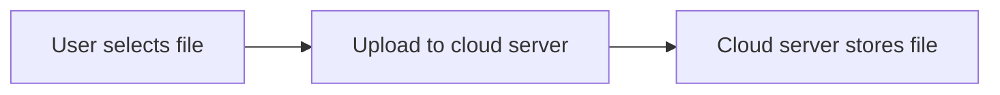
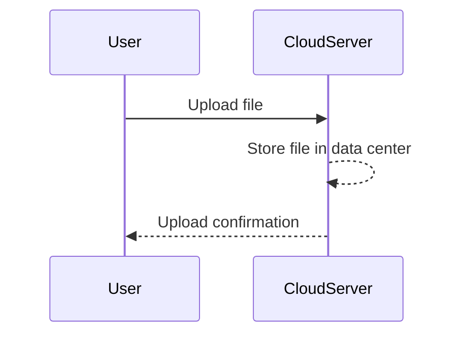
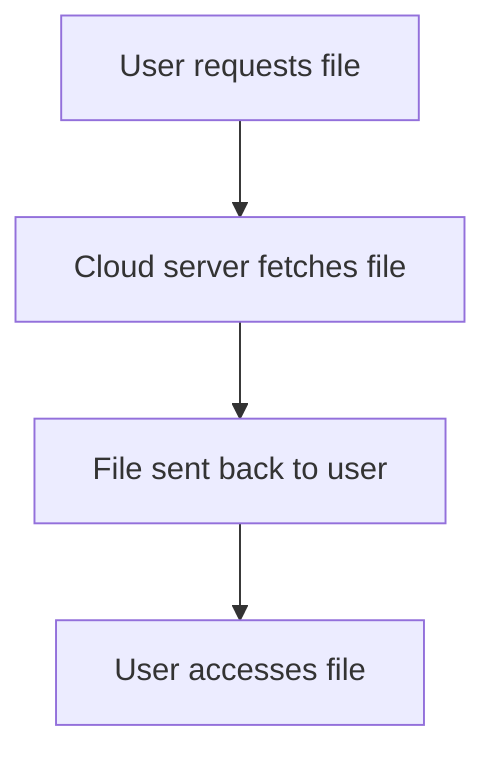
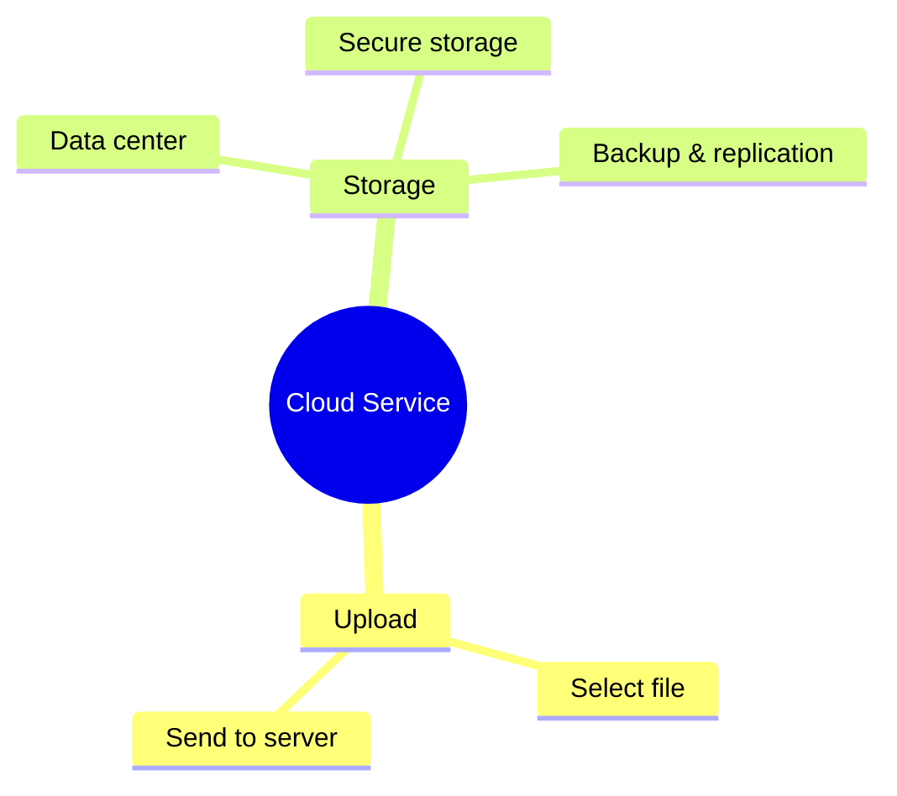
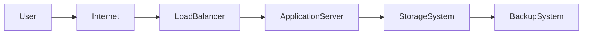

# How a Cloud Service Works

This guide explains how cloud services like Google Drive, Dropbox, and Amazon Web Services (AWS) work. It covers what happens when you upload files, how they are stored, and how you access them later.

---

## Step 1: Uploading a File

When you upload a file to a cloud service:

You choose a file on your device, and it is sent over the internet to a cloud server.

---

## Step 2: Cloud Server Stores Data

The cloud service saves your file in its data centers and confirms the upload.

Your file is securely stored in the provider's infrastructure.

---

## Step 3: Accessing Files

Later, when you want to access your file:

The cloud server retrieves your file and sends it back to you for viewing or downloading.

---

# Mindmap: Cloud Service Overview

---

# Architecture Diagram: How Cloud Storage Works

 

