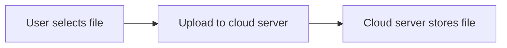
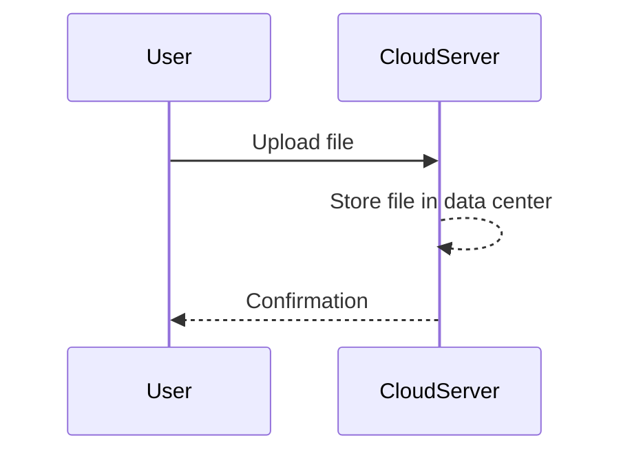
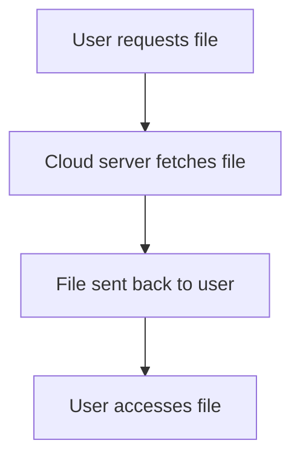

# How a Cloud Service Works

## Step 1: Uploading a File

When you upload a file:

You choose a file, and it’s sent to a cloud server.

## Step 2: Cloud Server Stores Data

The cloud service saves your file in its data centers.

Your file is stored securely, and you receive confirmation.

## Step 3: Accessing Files

Later, when you access your file:

The cloud server retrieves your file and sends it back to you.
